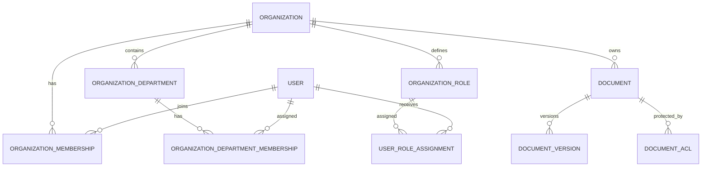

# Database Relationships

```mermaid
erDiagram
 ORGANIZATION ||--o{ ORGANIZATION_MEMBERSHIP : has
 USER ||--o{ ORGANIZATION_MEMBERSHIP : joins
 ORGANIZATION ||--o{ ORGANIZATION_DEPARTMENT : contains
 ORGANIZATION_DEPARTMENT ||--o{ ORGANIZATION_DEPARTMENT_MEMBERSHIP : has
 USER ||--o{ ORGANIZATION_DEPARTMENT_MEMBERSHIP : assigned
 ORGANIZATION ||--o{ ORGANIZATION_ROLE : defines
 ORGANIZATION_ROLE ||--o{ USER_ROLE_ASSIGNMENT : assigned
 USER ||--o{ USER_ROLE_ASSIGNMENT : receives
 ORGANIZATION ||--o{ DOCUMENT : owns
 DOCUMENT ||--o{ DOCUMENT_VERSION : versions
 DOCUMENT ||--o{ DOCUMENT_ACL : protected_by
```

Conceptual only; use SQLAlchemy models for exact key constraints.
