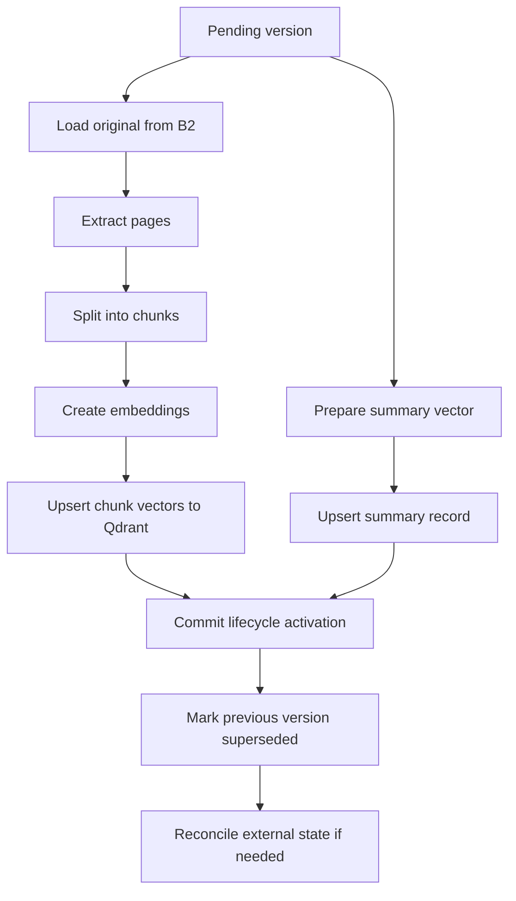

# Indexing Flow

```mermaid
flowchart TD
 A[Pending version] --> B[Load original from B2]
 B --> C[Extract pages]
 C --> D[Split into chunks]
 D --> E[Create embeddings]
 E --> F[Upsert chunk vectors to Qdrant]
 A --> G[Prepare summary vector]
 G --> H[Upsert summary record]
 F --> I[Commit lifecycle activation]
 H --> I
 I --> J[Mark previous version superseded]
 J --> K[Reconcile external state if needed]
```
