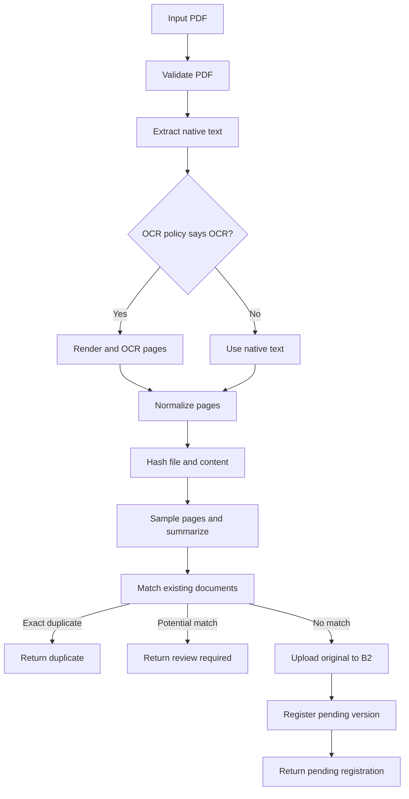

# Ingestion Flow

```mermaid
flowchart TD
 A[Input PDF] --> B[Validate PDF]
 B --> C[Extract native text]
 C --> D{OCR policy says OCR?}
 D -->|Yes| E[Render and OCR pages]
 D -->|No| F[Use native text]
 E --> G[Normalize pages]
 F --> G
 G --> H[Hash file and content]
 H --> I[Sample pages and summarize]
 I --> J[Match existing documents]
 J -->|Exact duplicate| K[Return duplicate]
 J -->|Potential match| L[Return review required]
 J -->|No match| M[Upload original to B2]
 M --> N[Register pending version]
 N --> O[Return pending registration]
```
