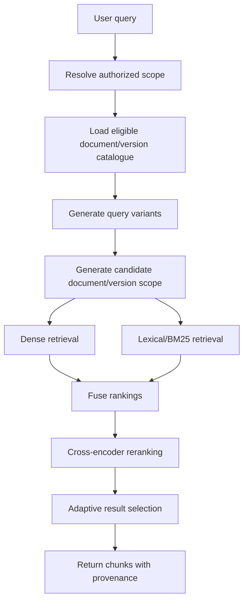

# Retrieval Flow

```mermaid
flowchart TD
 Q[User query] --> A[Resolve authorized scope]
 A --> C[Load eligible document/version catalogue]
 C --> M[Generate query variants]
 M --> D[Generate candidate document/version scope]
 D --> V[Dense retrieval]
 D --> L[Lexical/BM25 retrieval]
 V --> F[Fuse rankings]
 L --> F
 F --> R[Cross-encoder reranking]
 R --> K[Adaptive result selection]
 K --> O[Return chunks with provenance]
```
