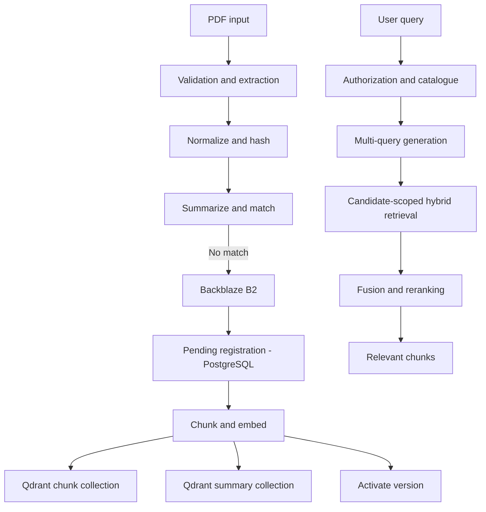

# System Architecture Diagram

```mermaid
flowchart TD
 PDF[PDF input] --> ING[Validation and extraction]
 ING --> NORM[Normalize and hash]
 NORM --> SUM[Summarize and match]
 SUM -->|No match| B2[Backblaze B2]
 B2 --> REG[Pending registration - PostgreSQL]
 REG --> IDX[Chunk and embed]
 IDX --> QD[Qdrant chunk collection]
 IDX --> QS[Qdrant summary collection]
 IDX --> ACT[Activate version]
 USER[User query] --> AUTH[Authorization and catalogue]
 AUTH --> MQ[Multi-query generation]
 MQ --> RET[Candidate-scoped hybrid retrieval]
 RET --> FUSE[Fusion and reranking]
 FUSE --> OUT[Relevant chunks]
```
