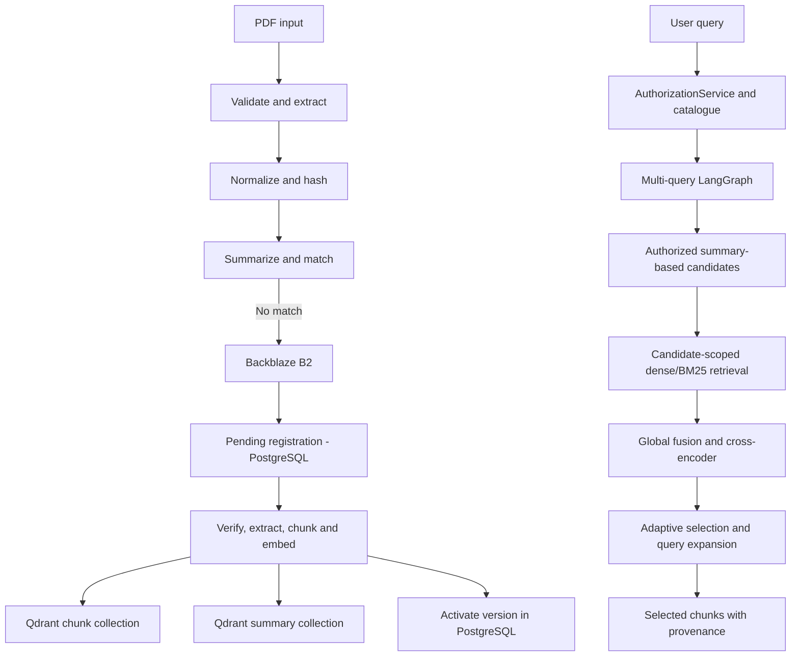

# System Architecture Diagram

```mermaid
flowchart TD
 PDF[PDF input] --> ING[Validate and extract]
 ING --> NORM[Normalize and hash]
 NORM --> SUM[Summarize and match]
 SUM -->|No match| B2[Backblaze B2]
 B2 --> REG[Pending registration - PostgreSQL]
 REG --> IDX[Verify, extract, chunk and embed]
 IDX --> QD[Qdrant chunk collection]
 IDX --> QS[Qdrant summary collection]
 IDX --> ACT[Activate version in PostgreSQL]
 USER[User query] --> AUTH[AuthorizationService and catalogue]
 AUTH --> MQ[Multi-query LangGraph]
 MQ --> CAND[Authorized summary-based candidates]
 CAND --> RET[Candidate-scoped dense/BM25 retrieval]
 RET --> FUSE[Global fusion and cross-encoder]
 FUSE --> ADAPT[Adaptive selection and query expansion]
 ADAPT --> OUT[Selected chunks with provenance]
```

The Redis-backed authorization cache exists as a separate helper and is not currently injected into the retrieval orchestrator.
