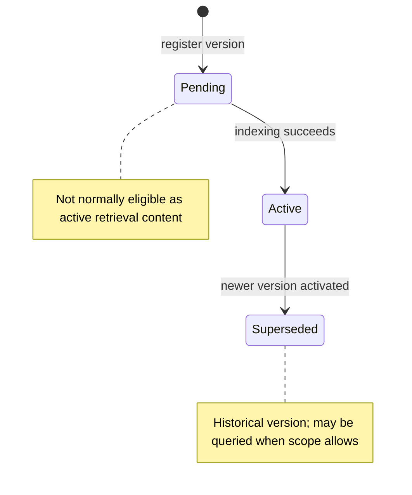

# Version Lifecycle

```mermaid
stateDiagram-v2
 [*] --> Pending: register version
 Pending --> Active: indexing succeeds
 Active --> Superseded: newer version activated
 note right of Pending
 Not normally eligible as active retrieval content
 end note
 note right of Superseded
 Historical version; may be queried when scope allows
 end note
```
